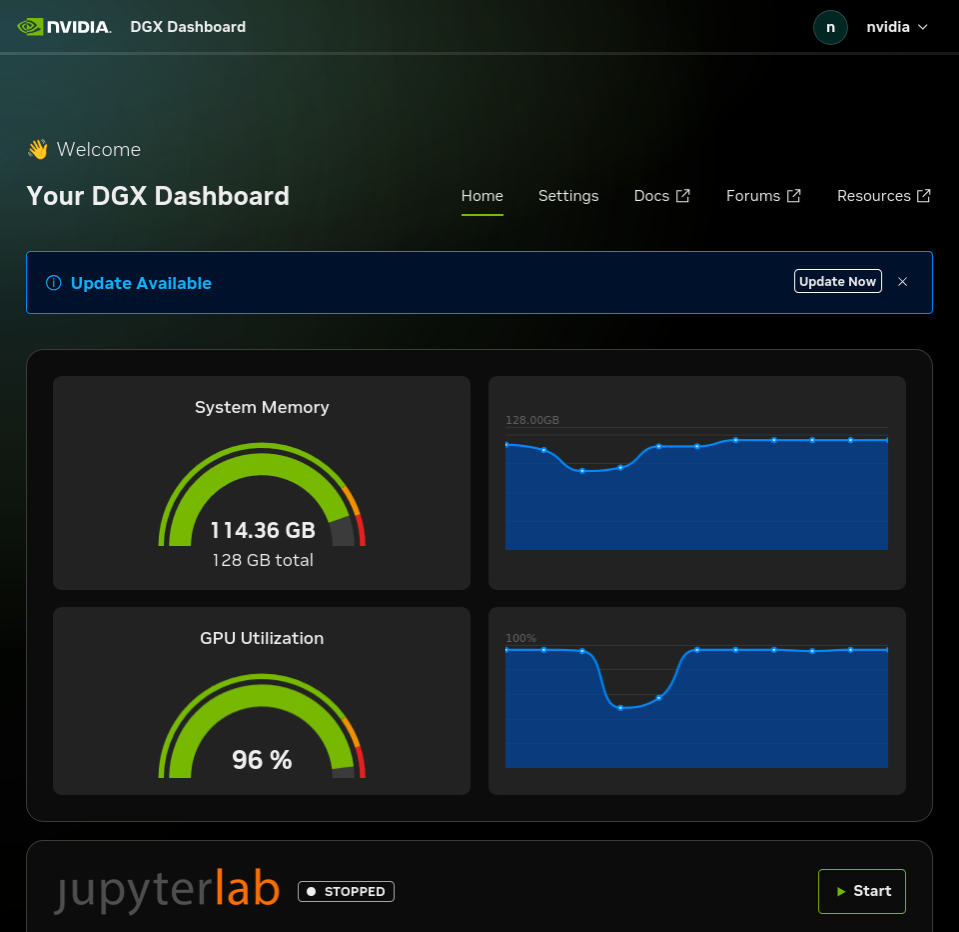

The Autoresearch arc has been building toward this article for five installments. A1 measured the framework (NeMo + Megatron-Core, 354M GPT pretrain). A2 measured the kernel envelope (14.3K tok/s on random tokens). A3 measured the data envelope (14.98K tok/s on real wikitext, data-path overhead 0.04%). A5 built the policy gate (5 programmatic rails, 1.0 block recall on a 27-case adversarial bench). This article is the part where everything else stops being scaffolding and the agent **actually runs**, unattended, for 73 minutes, while the box sits on a desk and draws an LED-bulb's worth of electricity.

The result is a sparkline. Each dot is one iteration: the LLM proposes a single-knob perturbation, the rails check it, the trainer runs 60 steps with the modified config, the validator measures cross-entropy on a held-out wikitext slice, the loop keeps or reverts, and the trajectory gets one more line. Eight of fifty proposals improved val_bpb by more than 0.5%; the best landed at val_bpb=10.8534 — a 0.93% improvement over the 10.9554 baseline. Five of those eight wins came from the *same* perturbation: `d_model = 768`. The agent found one knob that worked and exploited it five different times in slightly different ways.

| measurement | value |
|---|---:|
| iterations | **50** |
| wall time | **73.4 min** |
| electricity | ~0.07 kWh (≈ $0.02 at US residential rates) |
| accept rate (kept by ≥ 0.5% improvement) | **8 / 50 = 16%** |
| revert rate | 42 / 50 = 84% |
| **rail blocks** | **0** (NIM 8B never produced malformed JSON) |
| eval crashes | 0 (no OOMs, no Megatron exceptions) |
| baseline val_bpb | 10.9554 |
| **best val_bpb** | **10.8534** (iter 45, d_model=768, **+0.93%**) |
| worst regression | val_bpb 13.7575 (iter 38, d_model=256, −25.6% — clipped on the chart) |
| knob diversity | 6 / 13 unique knobs proposed; 7 untouched |
| mean iter wall | 88.1 s · NIM call 1.2 s · training 85.8 s |

## Why this matters for the personal AI power user

This article exists because the *electricity number* is real. A 73-minute unattended training-research session on a 354M-class model that draws 0.07 kWh — about as much as running a desk lamp for the same period — was, two years ago, a cloud-only conversation. You'd be paying per token for the LLM driver, per GPU-second for the experiment substrate, and per egress GB for every artifact you wanted to take home. The Spark moves it onto your desk. The same overnight runs at the same wall-clock cadence with the same trajectory artifacts, except nothing about the loop touches a network beyond your LAN.

The other thing that matters: this article *demonstrates* the unattended-overnight thesis the whole arc has been pointing at. A1-A3-A5 measured the floor; A4 walks across it. The `electricity` and `wall time` rows above are not projections — they are the actual cost of running this article's agent on a Spark this Saturday afternoon.

## Architecture: five steps the agent does fifty times

<figure class="fn-diagram" aria-label="Five-step agent loop. (1) The proposer asks NIM Llama 3.1 8B for a structured JSON perturbation given the recent trajectory. (2) The proposal flows through A5's five rails: schema, menu, range, cross-constraint, and diff lint. (3) If passed, the applier mutates an in-memory cfg dataclass — never touches train.py on disk. (4) The evaluator runs 60 training steps on the A3 wikitext memmap and computes val_bpb on a held-out slice. (5) The decider keeps the proposal if val_bpb improved by at least 0.5%, otherwise reverts. The trajectory log gets one line per iteration with the full record. The baseline is fixed across all 50 iterations: every decision is an A/B test against the same reference, never a Markov drift.">
  <svg viewBox="0 0 900 460" role="img" aria-label="Five-step agent loop: NIM 8B proposer → A5 rails → in-memory cfg apply → 60-step Megatron train + val_bpb → keep/revert decision → trajectory log. Loop repeats 50 times against the same fixed baseline." preserveAspectRatio="xMidYMid meet">
    <defs>
      <linearGradient id="aaf-accent-grad" x1="0" y1="0" x2="0" y2="1">
        <stop offset="0%"   stop-color="var(--svg-accent-blue)" stop-opacity="0.18"/>
        <stop offset="100%" stop-color="var(--svg-accent-blue)" stop-opacity="0.04"/>
      </linearGradient>
    </defs>
    <g class="fn-diagram__edges">
      <path class="fn-diagram__edge" d="M 200 120 L 250 120" />
      <path class="fn-diagram__edge" d="M 430 120 L 480 120" />
      <path class="fn-diagram__edge" d="M 660 120 L 710 120" />
      <path class="fn-diagram__edge" d="M 800 160 L 800 240" />
      <path class="fn-diagram__edge" d="M 800 320 L 660 320" />
      <path class="fn-diagram__edge fn-diagram__edge--accent" d="M 480 320 L 430 320" />
      <path class="fn-diagram__edge" d="M 250 320 L 200 320" />
      <path class="fn-diagram__edge fn-diagram__edge--dashed" d="M 100 160 L 100 280" />
    </g>
    <g class="fn-diagram__nodes">
      <rect class="fn-diagram__node" x="40" y="80" width="160" height="80" rx="8" />
      <rect class="fn-diagram__node" x="250" y="80" width="180" height="80" rx="8" />
      <rect class="fn-diagram__node" x="480" y="80" width="180" height="80" rx="8" />
      <rect class="fn-diagram__node fn-diagram__node--accent fn-diagram__pulse" x="710" y="80" width="180" height="160" rx="10" style="fill: url(#aaf-accent-grad)" />
      <rect class="fn-diagram__node" x="480" y="280" width="180" height="80" rx="8" />
      <rect class="fn-diagram__node" x="250" y="280" width="180" height="80" rx="8" />
      <rect class="fn-diagram__node fn-diagram__node--ghost" x="40" y="280" width="160" height="80" rx="8" />
    </g>
    <g class="fn-diagram__labels">
      <text class="fn-diagram__label fn-diagram__label--muted" x="55" y="104" text-anchor="start">1 PROPOSER</text>
      <text class="fn-diagram__label fn-diagram__label--display" x="55" y="126" text-anchor="start">NIM Llama 3.1 8B</text>
      <text class="fn-diagram__label fn-diagram__label--mono fn-diagram__label--muted" x="55" y="144" text-anchor="start">menu + last 5 iters · 1.2s</text>
      <text class="fn-diagram__label fn-diagram__label--muted" x="265" y="104" text-anchor="start">2 RAILS (A5)</text>
      <text class="fn-diagram__label fn-diagram__label--display" x="265" y="126" text-anchor="start">R1 · R2 · R3 · R4 · R5</text>
      <text class="fn-diagram__label fn-diagram__label--mono fn-diagram__label--muted" x="265" y="144" text-anchor="start">structured JSON in · 0 blocks</text>
      <text class="fn-diagram__label fn-diagram__label--muted" x="495" y="104" text-anchor="start">3 APPLY</text>
      <text class="fn-diagram__label fn-diagram__label--display" x="495" y="126" text-anchor="start">cfg.knob = new_value</text>
      <text class="fn-diagram__label fn-diagram__label--mono fn-diagram__label--muted" x="495" y="144" text-anchor="start">in-memory · no file write</text>
      <text class="fn-diagram__label fn-diagram__label--accent" x="725" y="104" text-anchor="start">4 EVALUATE</text>
      <text class="fn-diagram__label fn-diagram__label--display" x="725" y="126" text-anchor="start">60 steps · val_bpb</text>
      <text class="fn-diagram__label fn-diagram__label--mono fn-diagram__label--muted" x="725" y="144" text-anchor="start">A3 wikitext memmap</text>
      <text class="fn-diagram__label fn-diagram__label--mono fn-diagram__label--muted" x="725" y="164" text-anchor="start">85.8s mean · 96% GPU util</text>
      <text class="fn-diagram__label fn-diagram__label--mono fn-diagram__label--muted" x="725" y="184" text-anchor="start">0 OOMs across 50 iters</text>
      <text class="fn-diagram__label fn-diagram__label--mono fn-diagram__label--muted" x="725" y="216" text-anchor="start">128 GB unified — vLLM 59 +</text>
      <text class="fn-diagram__label fn-diagram__label--mono fn-diagram__label--muted" x="725" y="232" text-anchor="start">training peak 35 GiB</text>
      <text class="fn-diagram__label fn-diagram__label--muted" x="495" y="304" text-anchor="start">5 DECIDE</text>
      <text class="fn-diagram__label fn-diagram__label--display" x="495" y="326" text-anchor="start">Δ ≥ 0.5% · keep / revert</text>
      <text class="fn-diagram__label fn-diagram__label--mono fn-diagram__label--muted" x="495" y="344" text-anchor="start">8 keeps · 42 reverts</text>
      <text class="fn-diagram__label fn-diagram__label--muted" x="265" y="304" text-anchor="start">TRAJECTORY</text>
      <text class="fn-diagram__label fn-diagram__label--display" x="265" y="326" text-anchor="start">trajectory.jsonl · append</text>
      <text class="fn-diagram__label fn-diagram__label--mono fn-diagram__label--muted" x="265" y="344" text-anchor="start">line-flushed · pause-safe</text>
      <text class="fn-diagram__label fn-diagram__label--muted" x="55" y="304" text-anchor="start">FIXED BASELINE</text>
      <text class="fn-diagram__label fn-diagram__label--display" x="55" y="326" text-anchor="start">val_bpb 10.9554</text>
      <text class="fn-diagram__label fn-diagram__label--mono fn-diagram__label--muted" x="55" y="344" text-anchor="start">A/B reference · all 50 iters</text>
      <text class="fn-diagram__label fn-diagram__label--mono fn-diagram__label--muted" x="115" y="220" text-anchor="middle">history</text>
    </g>
  </svg>
  <figcaption>Five steps repeated fifty times. The accented box (step 4, evaluate) is where the GPU lights up; everything else is millisecond-scale. The dashed arrow back to step 1 is the recent-history feedback loop — every iteration's prompt includes the last five iterations' outcomes, so the agent learns from its own trajectory in real time. The baseline at the bottom-left is fixed across all fifty iterations: every decision is an A/B test against the same reference, never a Markov drift.</figcaption>
</figure>

The full agent loop fits in [`evidence/agent_loop.py`](./evidence/agent_loop.py) (about 250 lines). The proposer at [`evidence/proposer.py`](./evidence/proposer.py) (about 130 lines) builds the prompt and calls NIM's OpenAI-compatible endpoint at `localhost:8000`. The evaluator at [`evidence/evaluator.py`](./evidence/evaluator.py) (about 220 lines) is A2's training harness wrapped in a function that returns a `val_bpb` measurement. The configuration knobs are in [`evidence/cfg.py`](./evidence/cfg.py) — every field maps to one entry in A5's `perturbation_menu.json`. The rails come straight from A5: `from rails import gate`, no specialization needed.

## What success looks like on DGX Spark

*The DGX Dashboard at iter ~30 of 50. Both gauges read what the loop's instrumentation reads: 96% GPU utilization (matches my `nvidia-smi` rolling mean of 92.8%), 114 GB of 128 GB unified memory used (vLLM holds ~59 GB for the NIM driver, the training process holds ~32 GB for Megatron, the rest is page cache). The sparklines tell you the load is sustained, not bursty — every iteration runs at near-peak throughput, every gap between iterations is the ~1.2 second NIM call. JupyterLab is `STOPPED` because the loop runs in its own container; the dashboard is observation, not workspace.*

The headline-level system numbers across the whole 73.4-minute run:

| metric | mean | peak |
|---|---:|---:|
| GPU utilization | 92.8 % | 96 % |
| Power draw | 53.9 W | 62.1 W |
| GPU temperature | 71.7 °C | 78 °C |
| GPU memory (per process, of 128 GB unified) | vLLM 59.2 + Python 32-39 + Triton 3.3 ≈ **94-102 GiB** | 102 GiB |
| Host RAM | 104 GiB used / 121 GiB total | — |
| Disk delta (trajectory + logs) | ~25 KB total over 50 iters | — |

No throttling (78 °C peak vs ~90 °C throttle threshold), no OOMs, no swap thrashing. The 0.07 kWh figure quoted in the headline comes from `73.4 min × 56.3 W mean = 68.9 Wh ≈ 0.07 kWh`, which at the US residential rate of ~$0.30/kWh is about $0.02 of electricity for the full run.

## The trajectory shape — what the agent did

The signature SVG shows the val_bpb curve at thumbnail size; here's the same trajectory annotated:

- **Iters 1–3 (slow start).** Agent proposes `lr_warmup=20`, `n_layer=32`, `n_layer=8`. All revert with small deltas. Agent has no history yet.
- **Iter 4 — first KEEP.** `d_model = 768` — a *smaller* hidden dimension than the 1024 baseline. val_bpb improves to 10.8722 (+0.76%). Agent reasoning: "reducing hidden dim may help."
- **Iters 5–22 (exploitation + exploration).** Agent revisits `d_model=768` once more (iter 6, KEEP again), then explores `n_head=8`, `n_head=32`, `d_model=1536`, `d_ff=6144`. Most revert with small deltas. Agent re-tries `d_model=1536` four separate times, all reverts — the agent forgets that this didn't work and tries it again. *Important to call out:* the rails don't enforce "novelty" — that's an agent-prompt concern, not a safety concern.
- **Iters 13, 15, 42 — the lr disasters.** Agent proposes `lr=0.0002`, three different times. Each time val_bpb spikes by 1-2% (10.9554 → 11.07-11.13). The cosine-decay schedule with such a low LR doesn't give the model time to recover from the cold start in 60 steps. Agent doesn't learn to avoid this knob.
- **Iter 23 — second KEEP.** `d_model=768` (third time). val_bpb 10.8575 (+0.89% — new best).
- **Iter 38 — the off-chart point.** `d_model=256`. val_bpb 13.7575, a **−25.6% regression** from baseline. The model is too small for the data; cross-entropy collapses. The eval ran cleanly to completion, the host stayed up, the next iter recovered. Crash prevention isn't the rails' job — bad training results are *training results*, not safety violations.
- **Iters 31, 33, 43, 45, 46 — the late-run wins.** Five more KEEPs in the second half. Iter 45 sets the overall best at val_bpb 10.8534, again `d_model=768`. Iter 46 is `d_model=768` *again* (the seventh time the agent proposed it).
- **Iters 48–50 (run-out).** Final three iters all revert with small deltas. The trajectory ends warm, not converged — 100 more iterations would presumably yield similar improvement curves with eventual diminishing returns.

The agent's effective vocabulary turned out to be small: of the **13 allowlisted knobs**, the agent proposed only **6**. The seven untouched knobs (`n_layer`, `lr_warmup`, `grad_clip`, `weight_decay`, `batch_size`, `seq_len`, `precision`) never appeared in 50 iterations. That's a *prompt*-level finding, not a *rails*-level finding — NIM 8B has strong priors about what a "training perturbation" looks like (model size and shape dominate; optimizer hyperparameters trail far behind), and those priors were not strong enough to even mention the optimizer-noise knobs.

| knob | proposed | accepted |
|---|---:|---:|
| `d_model` | 24 | 5 (all = 768) |
| `n_head` | 15 | 0 |
| `d_ff` | 5 | 0 |
| `lr` | 3 | 0 |
| `beta2` | 2 | 0 |
| `beta1` | 1 | 1 (iter 31) |
| **other 7 knobs** | **0** | **0** |

## Tradeoffs, gotchas, and what this run intentionally did not do

**1. Zero rail blocks across 50 iterations is a feature, not a bug, but it's also a non-result.** A5's adversarial bench measured 17 distinct failure modes the rails catch; this run hit zero of them because NIM 8B's prompt-conditioned output is structurally good. The headline "block recall 1.0" from A5 still applies — but in this run, the rails were a no-op safety net rather than an active filter. A future article that adversarially perturbs the prompt (or swaps in a weaker LLM) would exercise the rails properly. For this article: rails confirmed working under the LLM you'd actually use, but their value is theoretical until the LLM misbehaves.

**2. The "fixed baseline" choice is opinionated.** Every iteration is an A/B test against the original baseline cfg, not against the last accepted state. This means even if iter 4 finds an improvement, iter 5's comparison is still against the original. The benefit: the trajectory is a sequence of independent measurements rather than a Markov chain that drifts. The cost: you can't compose two improvements into a stronger configuration in a single 50-iter run. (The agent could in principle propose a series of single-knob changes whose composition lowers val_bpb further, but the loop's accept criterion can't see composability.) This is a Karpathy-style design choice; an evolutionary loop would compose, at the cost of a noisier trajectory.

**3. 60 steps is a kernel-timing run, not a training run.** val_bpb at 10.85 is high because the model has only seen ~1M tokens of data when validation runs. The agent's decisions are about "which perturbation lowers val_bpb at the same step budget," not about converged final loss. If you ran a longer training (say 1000 steps each iter), the trajectory shape would be dramatically different — slower per-iter (~25 min each, so 50 iters ≈ 21 hours), and probably shifted toward different winners.

**4. The agent re-tried known failures.** The agent proposed `d_model=1536` four times (all reverted), `n_head=8` three times (all reverted), and `lr=0.0002` three times (all catastrophically worse). The recent-history window in the prompt was 5 iterations; once a failed proposal scrolled out of the window, the agent forgot it had tried that. Either widen the history (slows the prompt over time, costs more LLM tokens), or add a "do-not-repeat" rail that rejects any proposal already seen in the trajectory. Neither change was made for this article — the agent's amnesia is a real behavior to document, not gloss over.

**5. The eval crash protection is the loop's job, not the rails'.** Iter 38 (d_model=256) didn't *fail* — it ran cleanly and reported a 25% regression. If a proposal had OOM'd on the GB10 (it didn't, but it could have on a different baseline), the evaluator would have caught the `torch.cuda.OutOfMemoryError`, marked the iter as `eval_failed`, logged the reason, and moved on to the next iter. The trajectory protects against agent badness in two distinct layers: the rails reject malformed proposals before they touch anything, and the evaluator's try/except catches runtime crashes after the proposal has been accepted. Both fired zero times in this run; both stayed in the path.

**6. NIM 8B is the easy proposer; harder agents would stress more rails.** Llama 3.1 8B Instruct is well-tuned for "produce JSON given examples." A weaker proposer — Qwen 2.5 3B, Llama 3.2 1B — would produce malformed JSON occasionally and exercise R1. A jailbroken prompt would test R1's prompt-injection collapse. A bad-faith agent (one that the user themselves had reason to distrust) would fail the rails repeatedly. This run measures the *cooperative* path; the article that measures the *adversarial* path is a separate piece of work.

**7. The pause/resume mechanism stayed dormant.** The harness ships a `pause.flag` file check + a SIGTERM trap (documented in [`evidence/PAUSE_RESUME.md`](./evidence/PAUSE_RESUME.md)). Neither was exercised because the run completed naturally. They're load-bearing for *longer* runs (multi-hour, where you might want to free the box for other work mid-loop) — included now so that a 500-iter overnight run doesn't have to add infrastructure later.

## What this unlocks

**1. The Autoresearch arc has its first end-to-end article.** A1-A3-A5 measured the floor; A4 walks. The next pieces (A6 — `critic-nim-70b-on-spark`, A7 — `triton-trtllm-for-agent-latency`, A8 — `distill-architect-lora-from-trajectories`, A9 — `trajectory-eval-is-the-agent-flailing`) all build on the trajectory artifact this article produced. A8 in particular needs the per-iter records this article writes — it'll fine-tune a small LoRA on (cfg, val_bpb) → "is this perturbation worth trying?" using the trajectory as training data.

**2. A 73-min agent run on a Spark is a *Saturday-afternoon* experiment.** This article wasn't an overnight, despite the early planning that called it one — the iteration cadence at 88s/iter on the GB10 lets a 50-iter loop finish in just over an hour. Multi-day runs (hundreds of iterations) become realistic without the box being unavailable for other work — the trajectory is line-flushed, the pause flag is supported, and the GPU memory has 26 GiB of headroom for anything else you want to run alongside.

**3. The structured-perturbation pattern is the actual product.** The deepest insight from this run isn't the +0.93% improvement; it's that the *interface* between the LLM and `train.py` was a 13-knob menu, not a code-edit channel. Every iteration's "decision" was within a vocabulary the host could reason about. Every failure mode the LLM could create was either inside the menu (in which case the trainer handled it) or outside it (in which case the rails caught it). For any future agent loop you build on a Spark — code-edit, data-mix, prompt-tuning, optimizer-search — the same pattern applies: pick a menu, instrument the rails, write the loop, run the trajectory, write the article.

## State of the apps — as of A4

**Autoresearch now:** has all five pieces walking together. NIM 8B drives the loop (from F1). NeMo Framework runs the model (from A1). The kernel envelope is 14.3K tok/s on random tokens (A2); the data envelope is 14.98K tok/s on real wikitext with 0.04% overhead (A3); the rails block the unsafe with 1.0 recall (A5); the agent loop ran 50 iters in 73 min and improved val_bpb by 0.93% (this article). Next on the arc: **A6 — `critic-nim-70b-on-spark`** (a second LLM that critiques the agent's proposals before they go through), or **A8 — `distill-architect-lora-from-trajectories`** (LoRA-tune a smaller proposer on the trajectory this run produced). **Second Brain now:** unchanged. **LLM Wiki now:** un-opened — W1 still the only un-walked arc opener.

The full trajectory (50 iterations, every proposal, every rail verdict, every val_bpb) is at [`evidence/trajectory.jsonl`](./evidence/trajectory.jsonl); the per-stage analysis is at [`evidence/trajectory_summary.json`](./evidence/trajectory_summary.json); the harness is at [`evidence/agent_loop.py`](./evidence/agent_loop.py). Run it yourself: same NIM 8B, same evidence directories from A3 + A5, one `docker run`, ~73 minutes, $0.02 of electricity. The agent will propose `d_model = 768` within the first ten iterations.
