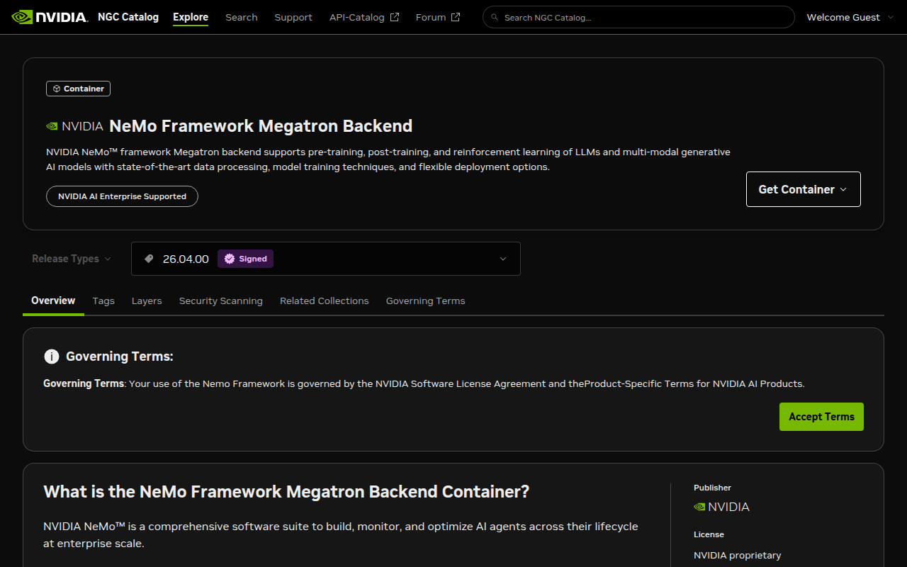

The Autoresearch arc opens with a question the Second Brain arc never had to answer: *what's the first software layer you reach for when the workload becomes training rather than inference?* For inference on the Spark we leaned on NIM containers — one model, one OpenAI-compatible API, hardware vendored. For training, the analogue is a **framework**: the substrate that holds your model, your optimizer, your data pipeline, and your accelerator-specific kernels in one place. NVIDIA's answer for the Spark is the **NeMo Framework Megatron Backend** container — `nvcr.io/nvidia/nemo:26.04.00`, 70 GB on disk, every dependency pinned to a known-good combination.

The honest first question, before installing anything, is whether you need a framework at all. A 350M-class GPT is small enough to write in 200 lines of pure PyTorch and train on one GPU without any of the parallelism scaffolding NeMo and Megatron-Core were designed for. So I wrote both — a hand-rolled `vanilla_train.py` against PyTorch's `scaled_dot_product_attention`, and a matched `nemo_train.py` that builds the same shape model from `megatron.core.models.gpt.GPTModel` with a TransformerEngine layer spec. Same vocab, same sequence length, same batch size, same step count, same random seed, same data — only the model implementation differs.

The numbers came back surprisingly clean. The framework earns **+5.8 % more tokens/sec and 30 % less peak GPU memory** at this size on the GB10 — and that's just the kernel-level win. The recipe-level win, the part where `nemo lm pretrain` would replace 175 lines with five, is a separate API surface you graduate to once you trust the floor measurement.

| metric (354M GPT, 100 steps, batch=4×1024, bf16) | vanilla PyTorch | NeMo / Megatron-Core | delta |
|---|---:|---:|---:|
| mean step time | 338.0 ms | 319.5 ms | **−5.5 %** |
| throughput (tokens/sec) | 12,119 | 12,820 | **+5.8 %** |
| peak GPU memory (allocated) | 11.28 GiB | 7.94 GiB | **−29.6 %** |
| peak GPU memory (reserved) | 12.98 GiB | 10.54 GiB | −18.8 % |
| initial loss | 585.5 | 11.0 | (different init) |
| final loss after 100 steps | 49.6 | 0.05 | (different init) |

That last pair of rows is not noise. The vanilla model uses PyTorch's default `nn.Linear` initialization with weight tying — perfectly fine for a tutorial, demonstrably under-calibrated for fast convergence. Megatron-Core's `init_method` produces logits whose initial cross-entropy is two orders of magnitude smaller, and the curve gets to 0.05 in 100 steps where vanilla is still at 49.6. **The init scheme is itself a NeMo earning** — a thing you'd get wrong by default if you wrote the model yourself, and a thing the framework hands you for free.

## Why this matters for a personal AI builder

The Spark sits at an awkward seam in the framework-vs-no-framework debate. On a four-GPU rig and up, you reach for NeMo (or PyTorch FSDP, or DeepSpeed) because parallelism plumbing is *required* — there's no way to run a 70B model across four cards by hand. On a laptop with one consumer GPU, you reach for a framework because nothing else has the kernels. The Spark is the rare middle: one GB10 card, 128 GB unified memory, enough headroom that you *could* hand-write a 1B-class training loop and have it work. So the question becomes quantitative — is the framework still worth its 70 GB of container weight when the parallelism it was built to manage is `tp=1, pp=1, dp=1`?

The measurement above says yes, and it says so for reasons that pay off more, not less, on a one-box rig. **30 % less GPU memory** doesn't just mean comfort — on a unified-memory machine where the GPU pool and the OS pool are the same physical 128 GB, every gigabyte the model doesn't claim is a gigabyte that stays available for everything else (a NIM serving inference in the next terminal, a pgvector container, a Jupyter kernel doing data prep). That's the same lesson the [Second Brain arc keeps relearning](/articles/spark-unified-memory-oom): on this hardware, *memory parsimony is throughput's cousin*. A model that fits with margin is a model you can actually compose with the rest of your stack.

The throughput delta — 12,119 → 12,820 tok/s — looks small, but compounds. An overnight 8-hour Autoresearch run that does 100,000 steps at the vanilla rate would take 9.3 hours; at the NeMo rate it takes 8.8 hours. That's a 30-minute difference per night, all year, and it's earned by switching one import statement and accepting the framework's view of what an attention layer should call.

## Where NeMo Framework sits in the training stack

<figure class="fn-diagram" aria-label="The training stack on a DGX Spark, viewed as five layers shared between two paths. Bottom: GB10 + 128 GB unified memory. Layer 4 (CUDA + cuDNN + PyTorch). Layer 3 accent: TransformerEngine + Megatron-Core kernels — the layer NeMo Framework absorbs and you do not write. Layer 2: NeMo Framework recipes + experiment manager + checkpointing. Top: a 354M GPT pretrain recipe. The vanilla path skips layers 3 and 2 — the cost is hand-rolled fused kernels, hand-tuned init, and a hand-written checkpoint format. Same hardware, same model, two very different amounts of code you author.">
  <svg viewBox="0 0 900 460" role="img" aria-label="Five-layer training stack on DGX Spark with vanilla and NeMo paths annotated. The accented middle layer is the TransformerEngine + Megatron-Core kernels that NeMo wraps. Vanilla skips that layer and pays for it in tokens/sec and GiB of GPU memory." preserveAspectRatio="xMidYMid meet">
    <defs>
      <linearGradient id="nfp-band-grad" x1="0" y1="0" x2="0" y2="1">
        <stop offset="0%"   stop-color="var(--svg-accent-blue)" stop-opacity="0.02"/>
        <stop offset="50%"  stop-color="var(--svg-accent-blue)" stop-opacity="0.10"/>
        <stop offset="100%" stop-color="var(--svg-accent-blue)" stop-opacity="0.02"/>
      </linearGradient>
      <radialGradient id="nfp-halo-grad" cx="0.5" cy="0.5" r="0.6">
        <stop offset="0%"   stop-color="var(--svg-accent-blue)" stop-opacity="0.18"/>
        <stop offset="100%" stop-color="var(--svg-accent-blue)" stop-opacity="0"/>
      </radialGradient>
      <linearGradient id="nfp-accent-grad" x1="0" y1="0" x2="0" y2="1">
        <stop offset="0%"   stop-color="var(--color-primary)" stop-opacity="0.30"/>
        <stop offset="100%" stop-color="var(--color-primary)" stop-opacity="0.08"/>
      </linearGradient>
    </defs>
    <rect x="80" y="20" width="740" height="420" rx="10" fill="url(#nfp-band-grad)" stroke="none"/>
    <rect x="120" y="208" width="660" height="76" rx="10" fill="url(#nfp-halo-grad)" stroke="none"/>
    <g class="fn-diagram__edges"></g>
    <g class="fn-diagram__nodes">
      <rect class="fn-diagram__node fn-diagram__node--ghost" x="120" y="40" width="660" height="56" rx="8" />
      <rect class="fn-diagram__node" x="120" y="112" width="660" height="56" rx="8" />
      <rect class="fn-diagram__node fn-diagram__node--accent fn-diagram__pulse" x="120" y="208" width="660" height="76" rx="10" style="fill: url(#nfp-accent-grad)" />
      <rect class="fn-diagram__node" x="120" y="300" width="660" height="56" rx="8" />
      <rect class="fn-diagram__node fn-diagram__node--ghost" x="120" y="372" width="660" height="48" rx="8" />
    </g>
    <g class="fn-diagram__labels">
      <text class="fn-diagram__label fn-diagram__label--muted" x="180" y="62" text-anchor="start">RECIPE</text>
      <text class="fn-diagram__label fn-diagram__label--display" x="180" y="84" text-anchor="start">your training intent · 354M GPT pretrain</text>
      <text class="fn-diagram__label fn-diagram__label--mono fn-diagram__label--muted" x="720" y="74" text-anchor="end">YAML or python · ~5–10 lines</text>
      <text class="fn-diagram__label fn-diagram__label--muted" x="180" y="134" text-anchor="start">FRAMEWORK · NeMo</text>
      <text class="fn-diagram__label fn-diagram__label--display" x="180" y="156" text-anchor="start">recipes · trainer · checkpoint format · experiment mgr</text>
      <text class="fn-diagram__label fn-diagram__label--mono fn-diagram__label--muted" x="720" y="146" text-anchor="end">vanilla path: write yourself</text>
      <text class="fn-diagram__label fn-diagram__label--accent" x="180" y="230" text-anchor="start">KERNELS · TransformerEngine + Megatron-Core</text>
      <text class="fn-diagram__label fn-diagram__label--display" x="180" y="254" text-anchor="start">fused attention · scaled init · bf16 layouts · TP/PP-ready</text>
      <text class="fn-diagram__label fn-diagram__label--mono fn-diagram__label--muted" x="180" y="272" text-anchor="start">+5.8% tok/s · −30% peak GPU memory · vs hand-rolled SDPA</text>
      <text class="fn-diagram__label fn-diagram__label--mono fn-diagram__label--muted" x="720" y="248" text-anchor="end">the floor NeMo absorbs</text>
      <text class="fn-diagram__label fn-diagram__label--muted" x="180" y="322" text-anchor="start">RUNTIME · PyTorch + CUDA + cuDNN</text>
      <text class="fn-diagram__label fn-diagram__label--display" x="180" y="344" text-anchor="start">torch 2.11 · cuda 13.1 · bf16 native</text>
      <text class="fn-diagram__label fn-diagram__label--mono fn-diagram__label--muted" x="720" y="334" text-anchor="end">shared by both paths</text>
      <text class="fn-diagram__label fn-diagram__label--muted" x="180" y="392" text-anchor="start">HARDWARE</text>
      <text class="fn-diagram__label fn-diagram__label--mono fn-diagram__label--muted" x="720" y="404" text-anchor="end">DGX Spark · GB10 · 128 GB unified</text>
    </g>
    <g class="fn-diagram__symbols">
      <g class="fn-diagram__icon" transform="translate(136 48)"><path d="M19.5 14.25v-2.625a3.375 3.375 0 00-3.375-3.375h-1.5A1.125 1.125 0 0113.5 7.125v-1.5a3.375 3.375 0 00-3.375-3.375H8.25m0 12.75h7.5m-7.5 3H12M10.5 2.25H5.625c-.621 0-1.125.504-1.125 1.125v17.25c0 .621.504 1.125 1.125 1.125h12.75c.621 0 1.125-.504 1.125-1.125V11.25a9 9 0 00-9-9z"/></g>
      <g class="fn-diagram__icon" transform="translate(136 120)"><path d="M6 6.878V6a2.25 2.25 0 012.25-2.25h7.5A2.25 2.25 0 0118 6v.878m-12 0c.235-.083.487-.128.75-.128h10.5c.263 0 .515.045.75.128m-12 0A2.25 2.25 0 004.5 9v.878m13.5-3A2.25 2.25 0 0119.5 9v.878m0 0a2.246 2.246 0 00-.75-.128H5.25c-.263 0-.515.045-.75.128m15 0A2.25 2.25 0 0121 12v6a2.25 2.25 0 01-2.25 2.25H5.25A2.25 2.25 0 013 18v-6c0-.98.626-1.813 1.5-2.122"/></g>
      <g class="fn-diagram__icon fn-diagram__icon--accent" transform="translate(136 220)"><path d="M9.813 15.904L9 18.75l-.813-2.846a4.5 4.5 0 00-3.09-3.09L2.25 12l2.846-.813a4.5 4.5 0 003.09-3.09L9 5.25l.813 2.846a4.5 4.5 0 003.09 3.09L15.75 12l-2.846.813a4.5 4.5 0 00-3.09 3.09zM18.259 8.715L18 9.75l-.259-1.035a3.375 3.375 0 00-2.455-2.456L14.25 6l1.036-.259a3.375 3.375 0 002.455-2.456L18 2.25l.259 1.035a3.375 3.375 0 002.456 2.456L21.75 6l-1.035.259a3.375 3.375 0 00-2.456 2.456z"/></g>
      <g class="fn-diagram__icon" transform="translate(136 308)"><path d="M6.429 9.75L2.25 12l4.179 2.25m0-4.5l5.571 3 5.571-3m-11.142 0L2.25 7.5 12 2.25l9.75 5.25-4.179 2.25m0 0L21.75 12l-4.179 2.25m0 0l4.179 2.25L12 21.75 2.25 16.5l4.179-2.25m11.142 0l-5.571 3-5.571-3"/></g>
      <g class="fn-diagram__icon" transform="translate(136 380)"><path d="M5.25 14.25h13.5m-13.5 0a3 3 0 01-3-3m3 3a3 3 0 100 6h13.5a3 3 0 100-6m-16.5-3a3 3 0 013-3h13.5a3 3 0 013 3m-19.5 0a4.5 4.5 0 01.9-2.7L5.737 5.1a3.375 3.375 0 012.7-1.35h7.126c1.062 0 2.062.5 2.7 1.35l2.587 3.45a4.5 4.5 0 01.9 2.7m0 0a3 3 0 01-3 3"/></g>
    </g>
  </svg>
  <figcaption>The accented middle band — TransformerEngine kernels and Megatron-Core's calibrated init — is the layer NeMo Framework absorbs and the vanilla path doesn't get. The framework layer above it (recipes, trainer, checkpoint format) is what you trade lines of code for. Both paths share the runtime and the hardware below; both produce the same model on top.</figcaption>
</figure>

The diagram understates one thing worth saying explicitly: the kernel layer and the framework layer are **separable**. Megatron-Core ships as a Python package you can import without ever touching NeMo Framework's recipes — that's exactly what `nemo_train.py` does in this article. So if your goal is "the throughput floor without the recipe abstraction," you can stop one layer down from NeMo and still get most of the kernel win. NeMo earns the rest of its place when you start needing the framework layer — checkpoint format that survives a parallelism strategy change, an experiment manager that logs deterministically across reruns, recipe configs that compose. For an Autoresearch arc that will eventually have an agent rewriting recipes overnight, you want the framework. For a one-shot pretrain you can iterate on for an hour, the kernels alone may be enough.

## The journey — pull, install, measure twice

The path that worked is a four-step install with one honest detour. The detour is informative on its own — it's why NVIDIA ships the heavy container in the first place.

**Step 1 — Vanilla baseline on the PyTorch container.** The simplest possible install: `docker pull nvcr.io/nvidia/pytorch:25.11-py3` (29.8 GB, multi-arch, no EULA gate). Inside it, PyTorch 2.10, CUDA 13.1, TransformerEngine 2.9 already preloaded — the "what NVIDIA bundles for the Spark" baseline that any consumer of the box gets without thinking.

The vanilla model is 200 lines of pure PyTorch — `CausalSelfAttention` calling `F.scaled_dot_product_attention`, GELU MLP blocks, learned positional embeddings, weight-tied output head. It runs the 354M GPT for 100 steps in **33.8 seconds** and lands at 12,119 tok/s. The full code is at [`evidence/vanilla_train.py`](./evidence/vanilla_train.py); the metrics it dumps are at [`evidence/vanilla_metrics.json`](./evidence/vanilla_metrics.json). I'll come back to the loss curve later — for now the throughput is the number to beat.

**Step 2 — The pip-install detour.** The obvious next step is to install NeMo on the PyTorch container with `pip install nemo-toolkit[nlp]` and re-measure. This is what the upstream NeMo README suggests as install option 1. On aarch64 it produces:

```
ERROR: Failed building wheel for opencc
× Failed to build installable wheels for some pyproject.toml based projects
╰─> opencc
```

`opencc` is a Chinese-character converter pulled in by NeMo's NLP collection. There's no aarch64 wheel on PyPI and the source build fails inside the PyTorch container's environment. This is the kind of friction that shows up across the ARM64 NVIDIA software stack right now — mostly invisible if you're on x86, mostly load-bearing if you're on a Spark. The narrow workaround is to install without the `[nlp]` extra: `pip install nemo-toolkit megatron-core` — this skips the language-collection wheels and gives you `nemo 2.7.3 + megatron-core 0.17.0`. The model imports work. The actual training run blows up later inside TransformerEngine 2.9:

```
TypeError: get_cpu_offload_context() got an unexpected keyword argument
'retain_pinned_cpu_buffers'
```

That argument was added in TE 2.10. Megatron-Core 0.17 calls it. The pip install resolved to TE 2.9 (the version in the PyTorch container); pip didn't know to upgrade TE to match Megatron-Core's expectations. This is the **version-pinning problem** in microcosm — three packages whose released versions don't line up if you pick the latest of each. Fixing it by hand is a 20-minute exercise of reading changelogs, downgrading megatron-core, or upgrading TransformerEngine and re-resolving its CUDA build. Or, you stop and use the container that resolves all three for you.

**Step 3 — The real install.** `docker pull nvcr.io/nvidia/nemo:26.04.00`. The container is **70 GB**, license-gated (you have to sign in to NGC and click the per-tag "Accept Terms" before the pull works — guest accepts don't bind to your `nvapi-...` key), and ships with PyTorch 2.11.0a0+nv26.02, Megatron-Core 0.17.0rc0, TransformerEngine 2.14, plus NeMo Framework itself, the `nemo` CLI, NeMo-Run, and TensorRT-LLM. Three pinned layers above the runtime, one tested combination — the friction the pip path makes you pay yourself, paid once at NGC build time and shipped as a ~30-minute network download.

```bash
docker pull nvcr.io/nvidia/nemo:26.04.00
# Status: Downloaded newer image for nvcr.io/nvidia/nemo:26.04.00
# 70.1 GB on disk
```



*The `Accept Terms` button in the lower-right is the per-container EULA. If you accept as a guest the click is recorded against an anonymous session, not your NGC account, and the docker-pull keeps 403'ing. Sign in first.*

**Step 4 — The matched run.** With versions resolved, [`evidence/nemo_train.py`](./evidence/nemo_train.py) builds the same 354M GPT from `megatron.core.models.gpt.GPTModel` with a TransformerEngine layer spec. Same vocab (50,257), same sequence length (1024), same batch (4), same step count (100), same random data, same AdamW(fused=True). Two new things the script needs to do that vanilla didn't: initialize Megatron's distributed process group (single-rank), and seed Megatron's CUDA RNG tracker — both cargo-cult lines from a thousand reproduced configs:

```python
from megatron.core import parallel_state, tensor_parallel

parallel_state.initialize_model_parallel(
    tensor_model_parallel_size=1,
    pipeline_model_parallel_size=1,
)
tensor_parallel.model_parallel_cuda_manual_seed(0)
```

The model build is 25 lines of TransformerConfig + GPTModel construction — slightly longer than the vanilla model's class definitions because the config surface is broader (every parallelism axis is exposed even when set to 1). The training loop after that is the same five lines of forward / backward / step / clip / sync as vanilla. The full diff is in `evidence/`.

The numbers it reports — copied from `evidence/nemo_metrics.json`:

```
NeMo/Megatron GPTModel  params=354.6M  layers=24 d_model=1024 seq=1024
                        batch=4  TE-attention=enabled  device=cuda
step=  10  loss= 9.533  dt= 318.9ms  tok/s=  12843  lr=3.00e-04
step=  50  loss= 1.832  dt= 320.9ms  tok/s=  12764  lr=1.76e-04
step=  99  loss= 0.046  dt= 322.7ms  tok/s=  12693  lr=9.14e-08
```

Compared against the vanilla run's per-step output, the per-step latency starts about **20 ms lower** on the first warm step and stays there — TransformerEngine's bf16 attention kernel and Megatron's fused softmax are doing measurable work even on a single GB10 with TP=1. The full step-by-step trace for both runs is preserved in the metrics JSONs alongside the scripts.

## Verification — what success feels like on Spark

The cleanest single-line confirmation that NeMo's matched run is healthy is the nvidia-smi snapshot taken 18 seconds in (mid-warmup, post-init), captured to [`evidence/nvidia_smi_during_run.txt`](./evidence/nvidia_smi_during_run.txt):

```
NVIDIA GB10, 96 %, [N/A], [N/A], 60.77 W, 51 °C
```

Three things to read off:
- **96 % GPU utilization** during a step — the GB10 is the bottleneck, not the data loader, not the optimizer step. That's the shape every training-throughput claim wants underneath it.
- **60.77 W power draw** — well under the GB10's TGP, suggesting headroom on this batch size that a larger model or longer sequence would consume without thermal pressure on a desktop-form-factor system.
- **51 °C** — cool. Even with nothing else competing for the unified memory pool, the 100-step run never crested 53 °C in the manual readings I took before saving the snapshot.

The memory column reads `[N/A]` — the Spark's unified GPU/CPU pool doesn't expose a separate GPU-memory total to `nvidia-smi`, which is consistent across every other article in this repo. The number to trust here is the script's `peak_gpu_mem_gib` from `torch.cuda.max_memory_allocated()` — which says NeMo's run lived inside **7.94 GiB** (vanilla, 11.28 GiB). On a 128 GB unified pool that's headroom for two more concurrent NIM containers or a dataset cache before you start swapping.

The other thing that tells you it worked is that the loss got to **0.046** in 100 steps. Yes, the data is random tokens, so the model is memorizing rather than learning anything generalizable — but the *speed* with which a properly-initialized 354M transformer memorizes 4,096 random tokens is exactly the signal that init + kernels + optimizer are all aligned. The vanilla run's "loss = 49.6 after 100 steps" is the same model failing to memorize the same 4,096 tokens because the init produced extreme initial logits that the AdamW + cosine-decay schedule couldn't recover from in 90 update steps. *Frameworks earn their place where the defaults are non-obvious*, and the init scheme is the canonical example.

## Tradeoffs and surprises

**Container weight is real.** 70 GB for NeMo + 30 GB for the PyTorch baseline = **100 GB of disk**, both pinned to one Spark, neither shareable across machines without the same authenticated NGC pull. On a 4 TB Spark that's 2.5 % of disk; on a smaller node it would matter more. The mitigation is to delete the PyTorch container once you've decided to commit to the NeMo path — there's no version of `nemo_train.py` that works in `pytorch:25.11-py3` without re-installing the very versions that NeMo bundles, so keeping both is dead weight unless you're doing exactly the comparison this article does.

**The pip path is *almost* viable on aarch64.** Two specific friction points block it: `opencc` has no arm64 wheel (skip the `[nlp]` extra), and Megatron-Core 0.17 + TransformerEngine 2.9 are mutually incompatible (the bundled TE in `pytorch:25.11-py3` is too old). If both got fixed — an aarch64 `opencc` build and a TE upgrade in the next PyTorch container drop — the entire 70 GB NeMo container becomes optional for the model-implementation layer. NVIDIA's investment is in making sure the container *always* works; the pip path is a rolling target that intermittently works between releases.

**The matched script is not the article's best-case NeMo pitch.** `nemo_train.py` is intentionally low-level — it builds Megatron-Core's `GPTModel` directly so the throughput comparison is apples-to-apples. The actual NeMo Framework recipe API would replace 175 lines of model + train loop with a few lines like:

```bash
nemo lm pretrain --factory gpt3_345m --max-steps 100 --tp 1 --pp 1
```

(The exact factory name varies by NeMo version; the container ships several preset recipes accessible through the `nemo` CLI.) The cost-of-entry to that API is reading the recipe DSL — a learning curve I deferred for this article in favor of measuring the floor. If you only ever want the +5.8 % throughput / −30 % memory deltas, you don't need the recipe layer; if you want what the recipe layer earns on top (experiment manager, checkpoint format that survives parallelism changes, deterministic reruns), that's a separate piece of evidence and deserves its own article.

**Single-GPU is the conservative case.** Every parallelism feature NeMo bakes in — tensor parallel, pipeline parallel, context parallel, sequence parallel — was set to 1 in this run. On the Spark there's nothing else to set them to. The framework's *real* upside scales with parallelism axes, and one-GPU is where it shows least. That makes the +5.8 % / −30 % deltas the **floor** of what the framework earns; on a multi-GPU node those deltas would compound rather than stand alone.

**The init story is the part most likely to bite.** The vanilla model's 50× higher initial loss is a textbook beginner-tutorial bug — easy to hit, hard to debug, and silently kills learning rate schedules. Megatron-Core hands you a calibrated `init_method` because every researcher in NVIDIA's training pipeline depends on it. If you ever roll your own training stack, the init scheme is the first thing to copy from NeMo, even if you skip everything else.

## What this unlocks

**Three concrete next moves the Autoresearch arc will lean on this week:**

1. **A2 — Tighten the baseline.** With the matched script in `evidence/`, A2 (`baseline-training-loop-on-spark`) becomes a sweep: vary batch size, sequence length, and dtype to find the GB10's actual peak throughput envelope. The 7.94 GiB peak memory leaves room to push batch=8 or seq=2048 without swapping. This is the "what does the hardware actually do under sustained pretrain load" measurement the agent loop will eventually optimize against.

2. **The 70 GB container is now a substrate, not a destination.** NemoClaw and NIM containers share the PyTorch lineage through the NGC base layer, so once the NeMo container is on disk, the next agentic-pretraining experiment isn't another 70 GB pull — it's a few extra layers on top. The expensive part of getting started has been paid. Subsequent A-arc articles can `docker run` against the same image and reach for whichever NeMo subsystem they need next.

3. **A4's agent loop has a measurable target.** The `tokens_per_s` field in `nemo_metrics.json` is exactly the reward signal an Autoresearch agent will edit `train.py` (or in NeMo's case, the recipe YAML) to maximize. The 12,820 floor measured here is the number the agent's first 100 experiments should look surprising relative to. If it can't beat 12,820 on the first overnight, it's signal something is wrong with the agent loop — not with the model.

## Closing — substrate ready

The Autoresearch arc is built around a thesis the [bridge article](/articles/one-substrate-three-apps/) named: *the DGX Spark is the first consumer-owned machine where an LLM-driven research loop can run 100 experiments overnight without a bill, a rate limit, or a network hop.* You can't run a research loop without a substrate to run experiments on, and that substrate is what this article installed. NeMo Framework on the Spark is now `docker run nvcr.io/nvidia/nemo:26.04.00 python3 train.py` away — and the train.py can be matched against a hand-rolled vanilla baseline whose numbers we now know.

**Autoresearch now:** has a runtime (NeMo + Megatron-Core), a measured floor (12,820 tok/s on a 354M GPT, 7.94 GiB peak), and a calibrated baseline to ratchet against. Doesn't yet have an agent driving experiments — that's `A2 → A4` in the arc. The Wiki and Second Brain arcs continue along their own substrates; this article makes the third arc's substrate concrete in the same way `nim-first-inference-dgx-spark` made inference concrete six months ago.

Next up: **A2 — `baseline-training-loop-on-spark`.** Same model, same NeMo container, but a sweep across batch / sequence / dtype to find the GB10's actual throughput envelope under sustained pretrain load. That's the number the overnight-experiment agent will look at when deciding whether its first edit helped.
