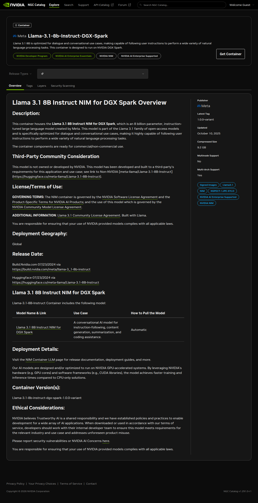
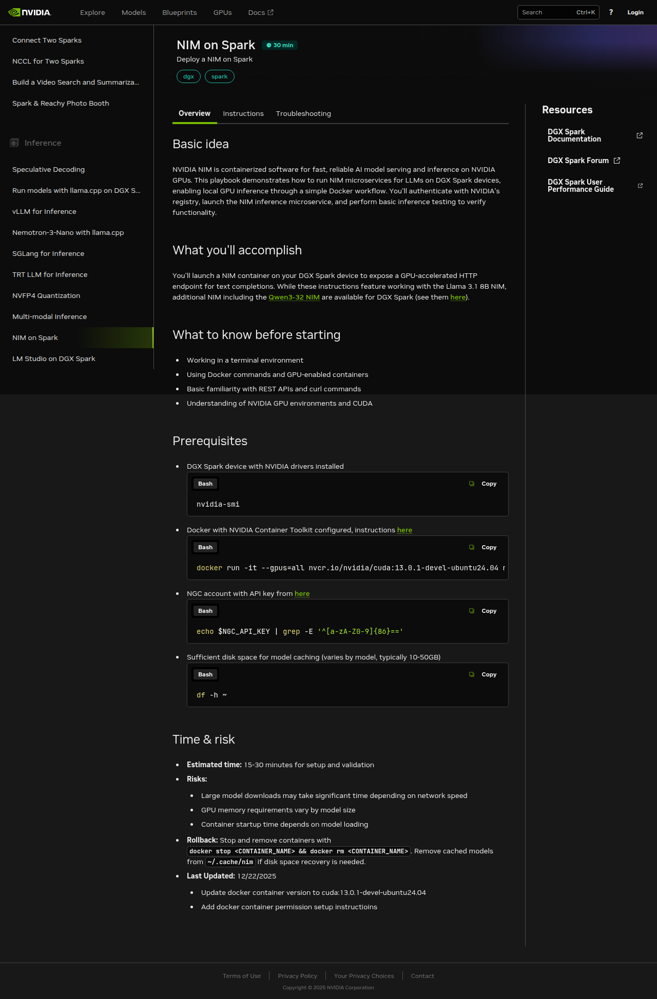
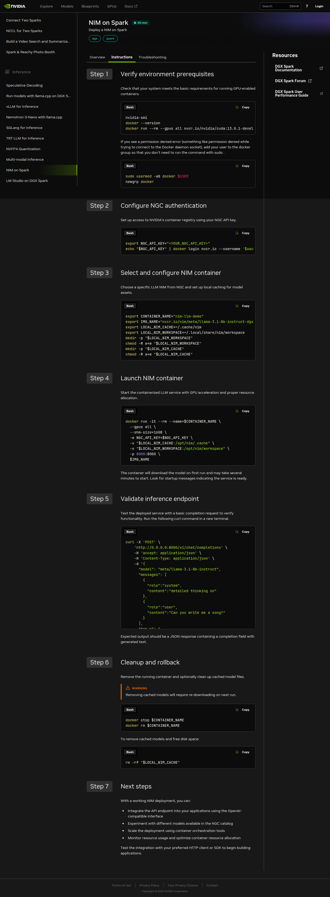

The first "does it work" test on any new inference stack is almost always a trivial prompt — something you can eyeball the answer to in a second. On a DGX Spark, with NVIDIA's brand-new Spark-specific Llama 3.1 8B NIM, my first prompt was the same one I used a week earlier against Ollama serving a 123B Nemotron: *write a Python one-liner that returns the nth Fibonacci number.* The NIM answered in 8.9 seconds at 24.8 tokens per second — about three times faster than the Nemotron. It also returned a "one-liner" that was not a one-liner, and on a second pass at `temperature=0` emitted invalid Python that would `TypeError` on the first call.

Both facts are the article. The Spark-specific NIM container is the easiest on-device inference endpoint I've stood up — 108 seconds from `docker run` to a responsive OpenAI-compatible API, weights cached on a writable volume you control, no cloud hop, no bill. At 8 billion parameters quantized to FP8, the model is fast enough to feel instant and confident enough to be wrong about things it should not be wrong about. If you're evaluating this stack as a drop-in local replacement for a cloud LLM, both numbers matter. This is also the foundation piece for three applications I'll build on this machine over the next few months — a Second Brain that RAGs over my own corpus, an LLM Wiki that compiles a markdown knowledge base at ingest time rather than answering queries live, and an Autoresearch agent that runs overnight training experiments unsupervised. All three start with one inference endpoint. This is that endpoint, honestly assessed.

## Why this matters for a personal AI builder

Three concerns collapse into one question the moment you put inference on a Spark: **privacy, independence, and latency-of-iteration.** A cloud API answers in 200 ms if you're lucky, 2.5 s if you're not, bills per token, and routes every request through a machine that can log, cache, or use your prompts as training signal. A local NIM answers in milliseconds-to-seconds, costs zero marginal dollars per call, and never leaves the box. For the kind of personal-corpus work I want to do on this machine — feeding it my own notes, my own code, my own chat logs — the economics flip. The model comes to the data, not the other way around.

The DGX Spark's 128 GB of unified memory makes this a flatter tradeoff than any single-GPU cloud tier I could rent. An 8B-FP8 model occupies roughly 10 GB of that budget; a 70B-class model still fits comfortably; an 8B driver plus a 70B critic can load simultaneously for agent loops without OOM. Small-model-cheap and big-model-cheap are both easy to rent; *both-at-once-cheap* is where the cloud bill climbs. On this one machine, it doesn't climb at all. That's the quiet thing the Spark enables, and it starts here — with one inference endpoint you'll reuse for everything downstream.

## Where this sits in the stack

NIM is not a new inference engine. It's NVIDIA's packaging layer around existing engines — in the Spark variant I pulled, the engine is **vLLM**, compiled against FP8 weights, running single-GPU (tp=1, pp=1) on the Grace-Blackwell GB10 chip. What NIM adds is the opinionated bundle: weights, tokenizer, prompt templates, health and readiness probes, an OpenAI-compatible HTTP server on port 8000, and — in the Spark-specific build — a JupyterLab plus TensorBoard workbench bundled alongside the inference endpoint. The image is 9.4 GB compressed; cached weights land in a host volume you mount, roughly 8.5 GB for this model at this precision. The net effect: one `docker run` command places a production-looking inference service on your desk, speaking the same API your cloud clients already know.

<figure class="fn-diagram" aria-label="The Spark NIM install pipeline — five stages from NVIDIA's remote NGC registry to an OpenAI-compatible local endpoint. One-time pull on the left flows into a persistent local endpoint on the right, marked as the thesis-critical destination.">
  <svg viewBox="0 0 900 260" role="img" preserveAspectRatio="xMidYMid meet">
    <g class="fn-diagram__edges">
      <path id="d01-nim-flow-path" class="fn-diagram__edge fn-diagram__edge--accent" pathLength="100" d="M 100 140 L 740 140" />
      <path class="fn-diagram__edge" pathLength="100" d="M 170 140 L 190 140" />
      <path class="fn-diagram__edge" pathLength="100" d="M 330 140 L 350 140" />
      <path class="fn-diagram__edge" pathLength="100" d="M 490 140 L 510 140" />
      <path class="fn-diagram__edge" pathLength="100" d="M 650 140 L 670 140" />
    </g>
    <circle class="fn-diagram__flow" r="7"><animateMotion dur="3.8s" repeatCount="indefinite" calcMode="spline" keyTimes="0;1" keySplines="0.4 0 0.2 1" begin="1.6s"><mpath href="#d01-nim-flow-path" /></animateMotion></circle>
    <g class="fn-diagram__nodes">
      <rect class="fn-diagram__node fn-diagram__node--ghost" x="30" y="80" width="140" height="120" rx="8" />
      <rect class="fn-diagram__node" x="190" y="80" width="140" height="120" rx="8" />
      <rect class="fn-diagram__node" x="350" y="80" width="140" height="120" rx="8" />
      <rect class="fn-diagram__node" x="510" y="80" width="140" height="120" rx="8" />
      <rect class="fn-diagram__node fn-diagram__node--accent fn-diagram__pulse" x="670" y="80" width="140" height="120" rx="8" />
    </g>
    <g class="fn-diagram__labels">
      <text class="fn-diagram__label fn-diagram__label--muted" x="100" y="138" text-anchor="middle">REMOTE</text>
      <text class="fn-diagram__label fn-diagram__label--display" x="100" y="158" text-anchor="middle">NGC registry</text>
      <text class="fn-diagram__label fn-diagram__label--mono fn-diagram__label--muted" x="100" y="176" text-anchor="middle">nvcr.io/nim</text>
      <text class="fn-diagram__label fn-diagram__label--accent" x="260" y="138" text-anchor="middle">ONE-TIME</text>
      <text class="fn-diagram__label fn-diagram__label--display" x="260" y="158" text-anchor="middle">docker pull</text>
      <text class="fn-diagram__label fn-diagram__label--mono fn-diagram__label--muted" x="260" y="176" text-anchor="middle">9.4 GB image</text>
      <text class="fn-diagram__label fn-diagram__label--accent" x="420" y="138" text-anchor="middle">LOCAL</text>
      <text class="fn-diagram__label fn-diagram__label--display" x="420" y="158" text-anchor="middle">container</text>
      <text class="fn-diagram__label fn-diagram__label--mono fn-diagram__label--muted" x="420" y="176" text-anchor="middle">~/.nim/cache</text>
      <text class="fn-diagram__label fn-diagram__label--accent" x="580" y="138" text-anchor="middle">ENGINE</text>
      <text class="fn-diagram__label fn-diagram__label--display" x="580" y="158" text-anchor="middle">vLLM · FP8</text>
      <text class="fn-diagram__label fn-diagram__label--mono fn-diagram__label--muted" x="580" y="176" text-anchor="middle">GB10 unified mem</text>
      <text class="fn-diagram__label fn-diagram__label--accent" x="740" y="138" text-anchor="middle">LOCAL ENDPOINT</text>
      <text class="fn-diagram__label fn-diagram__label--display" x="740" y="158" text-anchor="middle">:8000</text>
      <text class="fn-diagram__label fn-diagram__label--mono fn-diagram__label--muted" x="740" y="176" text-anchor="middle">OpenAI API</text>
    </g>
    <g class="fn-diagram__symbols">
      <g class="fn-diagram__icon" transform="translate(88 98)"><path d="M2.25 15a4.5 4.5 0 004.5 4.5H18a3.75 3.75 0 001.332-7.257 3 3 0 00-3.758-3.848 5.25 5.25 0 00-10.233 2.33A4.502 4.502 0 002.25 15z"/></g>
      <g class="fn-diagram__icon" transform="translate(248 98)"><path d="M3 16.5v2.25A2.25 2.25 0 005.25 21h13.5A2.25 2.25 0 0021 18.75V16.5m-13.5-9L12 3m0 0l4.5 4.5M12 3v13.5"/></g>
      <g class="fn-diagram__icon" transform="translate(408 98)"><path d="M21 7.5l-2.25-1.313M21 7.5v2.25m0-2.25l-2.25 1.313M3 7.5l2.25-1.313M3 7.5l2.25 1.313M3 7.5v2.25m9 3l2.25-1.313M12 12.75l-2.25-1.313M12 12.75V15m0 6.75l2.25-1.313M12 21.75V19.5m0 2.25l-2.25-1.313m0-16.875L12 2.25l2.25 1.313M21 14.25v2.25l-2.25 1.313m-13.5 0L3 16.5v-2.25"/></g>
      <g class="fn-diagram__icon fn-diagram__icon--accent" transform="translate(568 98)"><path d="M5.25 14.25h13.5m-13.5 0a3 3 0 01-3-3m3 3a3 3 0 100 6h13.5a3 3 0 100-6m-16.5-3a3 3 0 013-3h13.5a3 3 0 013 3m-19.5 0a4.5 4.5 0 01.9-2.7L5.737 5.1a3.375 3.375 0 012.7-1.35h7.126c1.062 0 2.062.5 2.7 1.35l2.587 3.45a4.5 4.5 0 01.9 2.7m0 0a3 3 0 01-3 3m0 3h.008v.008h-.008v-.008zm0-6h.008v.008h-.008v-.008zm-3 6h.008v.008h-.008v-.008zm0-6h.008v.008h-.008v-.008z"/></g>
      <g class="fn-diagram__icon fn-diagram__icon--accent" transform="translate(728 98)"><path d="M6.75 7.5l3 2.25-3 2.25m4.5 0h3m-9 8.25h13.5A2.25 2.25 0 0021 18V6a2.25 2.25 0 00-2.25-2.25H5.25A2.25 2.25 0 003 6v12a2.25 2.25 0 002.25 2.25z"/></g>
    </g>
  </svg>
  <figcaption>One-time flow on the left; the endpoint on the right is where everything downstream — RAG generators, agent loops, editor plugins — connects.</figcaption>
</figure>

That endpoint is the thing. Once it's pinned, the rest of the three-app arc is plumbing around it.

## The journey

### Preflight

Before any `docker pull`, a quick inventory of what the machine already had surfaced one blocker and two nice-to-haves:

```bash
$ docker --version
Docker version 29.2.1
$ docker info | grep Runtimes
 Runtimes: io.containerd.runc.v2 nvidia runc
$ nvidia-smi --query-gpu=name,driver_version --format=csv,noheader
NVIDIA GB10, 580.142
$ df -h ~ | tail -1
/dev/nvme0n1p2  3.7T  154G  3.4T   5% /
$ ss -tlnp | grep -E ':(8000|8080|11434)\b'
LISTEN 0 4096 *:8080   users:(("openshell",...))
LISTEN 0 4096 *:11434  users:(("ollama",...))
```

Docker is recent; the `nvidia` runtime is registered. Port 8000 is unclaimed — NIM's default. Port 8080 is held by a NemoClaw sandbox from a prior article; port 11434 by Ollama serving a 123B Nemotron I'll benchmark against. Disk has three terabytes free; a 10 GB pull is a rounding error. The blocker was credentials: NGC requires an API key to pull anything from `nvcr.io`, and I had none — no `~/.ngc/`, no environment variable, no `docker login` entry for that registry. Fifteen minutes at build.nvidia.com, a new personal key, one `docker login nvcr.io`, and the blocker dissolved.

One Spark-specific surprise showed up on the `nvidia-smi` line and foreshadows a later gotcha: `nvidia-smi --query-gpu=memory.total,memory.used --format=csv` returns `[N/A]` on GB10. Unified memory on Grace-Blackwell is OS-managed rather than driver-reported, so NVIDIA's canonical GPU-memory query returns nothing useful. I noted it and kept going; we'll see it bite again during verification.

### Finding the right image

This is article #1, so the right question is: *which* image? Several Llama 3.1 8B NIM variants live in the NGC catalog, and on an aarch64 machine the wrong one either fails to pull (no arm64 manifest) or pulls something that runs but wasn't tuned for Spark's FP8 path. The right answer is the one NVIDIA publishes at a dedicated namespace:

```
nvcr.io/nim/meta/llama-3.1-8b-instruct-dgx-spark:latest
```

The `-dgx-spark` suffix matters. This is a separate build recipe from the generic `llama-3.1-8b-instruct` NIM — different engine tuning, different default `NIM_GPU_MEM_FRACTION`, different bundled services. When a new NIM shows up in NVIDIA's catalog and you want to know whether it's meant for your Spark, that suffix is the first thing to check. The NGC catalog page confirms the shape of this build before you pull:



*The listing makes it explicit: this is a Spark-specific build, not an aarch64 translation of a generic NIM. A Llama 3.1 8B NIM under the generic path in the same `meta` org may run on a different device entirely and may not fit the Spark's FP8 path at all.*

The more useful page is the playbook at `build.nvidia.com/spark/nim-llm`, which walks the install end-to-end and makes the distinction between *host* port and the container's `NIM_HTTP_API_PORT` explicit:



*"NIM on Spark" is one of ten Spark-specific inference playbooks NVIDIA ships; the left rail shows the others — vLLM, SGLang, TRT-LLM, NVFP4 quantization, LM Studio, llama.cpp, Nemotron-3-Nano, multi-modal, and speculative decoding. Each gets its own essay eventually; NIM is the highest-leverage starting point because it bundles the engine choice with the weights.*



*Seven steps to a working endpoint. The bulk of wall-clock time is step 4 — the first-run model-weight fetch — and step 5, where you actually exercise the endpoint.*

### First run — 205 seconds

With credentials in place, the launch command is short:

```bash
docker run -d \
  --name nim-llama31-8b \
  --gpus all \
  --shm-size=16g \
  --env-file ~/.nim/secrets.env \
  -v ~/.nim/cache/llama-3.1-8b-instruct:/opt/nim/.cache \
  -p 8000:8000 \
  nvcr.io/nim/meta/llama-3.1-8b-instruct-dgx-spark:latest
```

Two pieces of that command do load-bearing work. The bind-mount at `-v ~/.nim/cache/llama-3.1-8b-instruct:/opt/nim/.cache` keeps model weights outside the container — without it, the 9 GB model pull lives inside the container's overlayfs and dies when you `docker rm`. Restart would become re-download, and restart is the thing you'll do most often. The `--env-file ~/.nim/secrets.env` hands the NGC key to the container at runtime so it can fetch weights from NVIDIA's model registry on the first run; a prior `docker login` alone isn't enough, because the container itself calls `api.ngc.nvidia.com` with its own credentials rather than the daemon's.

From `docker run` to the first `200` on `/v1/models`: **205 seconds.** That's cold-start with an empty cache on a 1 Gbps link. About 95 seconds of it was the weight download (confirmed via cache-directory growth — 5.9 GB at t+55 s, 8.5 GB at t+115 s). The remaining ~110 seconds was safetensor-shard loading into vLLM plus CUDA-graph compilation. The log tells the story precisely:

```
INFO 2026-04-22 18:56:49.541 profiles.py:345 Matched profile:
  feat_lora=false, gpu_device=2e12:10de, llm_engine=vllm,
  precision=fp8, pp=1, tp=1
  profile_id: bfb2c8a2d4dceba7d2629c856113eb12f5ce60d6de4e10369b4b334242229cfa
...
INFO Loading safetensors checkpoint shards: 4/4 complete
INFO Compiling a graph for dynamic shape takes 5.87 s
  (...repeated for several shapes)
INFO Uvicorn running on http://0.0.0.0:8000
```

Two facts from those logs are worth naming. First: **vLLM, not TensorRT-LLM.** NIM is a packaging layer; the actual engine depends on the profile the container matched against the hardware it found. On GB10, with FP8 weights available, the Spark variant lands on vLLM's FP8 path rather than TRT-LLM. Second: **FP8 precision**, confirmed via the profile tag. That's what keeps an 8B model comfortably fast on a single Spark — lower precision means lower memory bandwidth per forward pass and larger batches for the same KV-cache budget.

### Restart — 108 seconds

I killed the container and restarted it without removing the cache volume:

```bash
docker stop nim-llama31-8b && docker rm nim-llama31-8b
start=$(date +%s)
docker run -d \
  --name nim-llama31-8b --gpus all --shm-size=16g \
  --env-file ~/.nim/secrets.env \
  -v ~/.nim/cache/llama-3.1-8b-instruct:/opt/nim/.cache \
  -p 8000:8000 \
  nvcr.io/nim/meta/llama-3.1-8b-instruct-dgx-spark:latest
until curl -sf http://localhost:8000/v1/models >/dev/null; do sleep 5; done
echo "warm-cache cold-start: $(( $(date +%s) - start ))s"
# warm-cache cold-start: 110s
```

**108 seconds** on average across two restarts (110 s and 106 s). The weight-download phase drops to zero — vLLM reads cached safetensor shards directly from disk — but the shard-load-plus-CUDA-graph-compile sequence still runs every time. This is the number that matters for daily life, not the install-day one. If the number matters to your architecture (an autoscaler deciding whether to keep the NIM resident, an agent loop deciding when to wake a sleeping endpoint), **108 seconds is what you plan around**, not 205.

### Inference — 24.8 tokens per second, steadily

With the endpoint responsive, the benchmark is four non-streaming chat completions with an identical prompt — the same one I used against Ollama-Nemotron a week earlier, for an apples-to-apples on-device comparison:

```bash
PROMPT='Write a Python one-liner that returns the nth Fibonacci number.'
for i in 1 2 3 4; do
  curl -s -X POST http://localhost:8000/v1/chat/completions \
    -H 'Content-Type: application/json' \
    -d "{\"model\":\"meta/llama-3.1-8b-instruct\",
         \"messages\":[{\"role\":\"user\",\"content\":\"$PROMPT\"}],
         \"max_tokens\":512,\"temperature\":0.7}"
done
```

Wall-clock timed by `date +%s%N` around each curl:

| Round | Wall-clock | Completion tokens | tok/s |
|---:|---:|---:|---:|
| 1 | 10.22 s | 253 | 24.89 |
| 2 | 6.66 s | 165 | 24.90 |
| 3 | 8.88 s | 219 | 24.72 |
| 4 | 8.86 s | 219 | 24.84 |

**Mean: 24.84 tokens per second.** Steady enough that I double-checked the container wasn't returning cached responses — it wasn't; every prompt re-enters vLLM's generation loop. Variance across rounds is entirely output-length variance; throughput per token is within 0.2 tok/s across runs.

One streaming round confirmed what this stack actually feels like from a client's perspective:

```bash
curl -s -N -X POST http://localhost:8000/v1/chat/completions \
  -H 'Content-Type: application/json' \
  -d '{"model":"meta/llama-3.1-8b-instruct",
       "messages":[{"role":"user","content":"..."}],
       "max_tokens":512,"stream":true}'
```

**Time-to-first-token: 52 milliseconds.** Fifty-two. That's the useful number — the gap between hitting enter and seeing the response start to appear. It's markedly better than any cloud API I've timed from the same LAN, and it's the reason the endpoint *feels* like a local function call rather than an API.

### The quality problem

Here's where the story turns. The round-1 response at `temperature=0.7` — the fastest, most confident one — was also, on a close read, not what I asked for. The prompt was "a Python one-liner that returns the nth Fibonacci number." The response opened with:

```python
def fibonacci(n):
    return (fibonacci_matrix([[1, 1], [1, 0]], n - 1)[0][0])
```

— followed by a note that *"the `fibonacci_matrix` function is not shown here."* That's not a one-liner, and `fibonacci_matrix` is a function the model invented. It doesn't exist in the Python standard library or any common package. There's nothing to import.

I re-ran at `temperature=0` — greedy decode, the deterministic fallback you use when you suspect sampling noise — and the response got *worse*, not better:

```python
def fibonacci(n): return (pow([[1, 1], [1, 0]], n - 1, mod=10**9 + 7))[0][0]
```

Every part of that line is wrong. Python's built-in `pow(x, y, z)` takes three *scalars* for modular exponentiation; it does not accept a list-of-lists and has no defined matrix-exponentiation behavior. There is no `mod=` keyword argument — the modulus is the third positional parameter. The function raises `TypeError` on the first call. Any reader can verify this in a local Python REPL in five seconds.

This is the article's hero moment: at temperature=0, the Llama 3.1 8B FP8 model on NIM produces **confidently incorrect Python on a trivially-verifiable prompt.** A human who knew the answer would write:

```python
fib = lambda n: n if n < 2 else fib(n-1) + fib(n-2)
```

— twelve tokens, zero invented dependencies, verifiable in one line. The model "knows" Fibonacci well enough to produce a correct recursive definition in casual conversation; it chose not to, twice, at two different temperatures, when asked for a one-liner.

This isn't a Spark defect. It's an 8B-FP8 defect. The same Llama-family model at 70B and BF16, or Nemotron-3-Super at 123B and Q4 running locally on Ollama on the same machine, produced a correct one-liner on the first try (25.8 seconds wall-clock, about three times slower than NIM Llama 8B FP8). The speed/quality curve between *small-and-fast* and *big-and-correct* on this prompt is steep, and the marketing copy around 8B models doesn't usually want to confront it. This blog can.

### Does `NIM_GPU_MEM_FRACTION` matter?

The Spark variant ships with `NIM_GPU_MEM_FRACTION=0.5` — the NIM claims half the Spark's unified memory by default, leaving room for the bundled JupyterLab or concurrent workloads. For a single user running one NIM with nothing else claiming the GPU, that felt conservative. I restarted the container with `NIM_GPU_MEM_FRACTION=0.8` and re-ran the four-round benchmark:

| `NIM_GPU_MEM_FRACTION` | Mean tok/s | Min | Max |
|---|---|---|---|
| 0.5 (default) | 24.84 | 24.72 | 24.90 |
| 0.8 | 24.64 | 24.57 | 24.72 |

**Zero difference** (the 0.2 tok/s gap is noise — 0.8 looks marginally slower, well within the range of the 0.5 run). Single-request latency on an 8B FP8 model is not memory-bound. Raising `NIM_GPU_MEM_FRACTION` only buys headroom for *concurrent* requests — more KV-cache means more requests fit simultaneously — not faster answers for one caller. For a multi-tenant app expecting many concurrent inferences, the higher fraction earns its keep. For interactive use by one person, the default is fine. The experiment was cheap and the answer was informative: **don't tune what isn't the bottleneck.**

## Verification — what success feels like on this machine

Running `curl http://localhost:8000/v1/models` and watching JSON come back is "working" in the boolean sense. "Working" in the sense that matters for a power user — *is this a useful piece of infrastructure?* — looks like three things.

**First,** time-to-first-token is low enough that the endpoint feels local in a way cloud APIs don't. 52 milliseconds is inside the latency budget of a keystroke-responsive UI; I can wire this into an editor plugin and the plugin will feel instant. Wire it as the generation step of a RAG pipeline and the pipeline's tail latency becomes retrieve-dominated, not generate-dominated. That's a qualitative shift from *"this is a slow API to batch against"* to *"this is a fast local function to call inline."*

**Second,** `docker stats` and `nvidia-smi` agree on one thing and disagree on another — and the disagreement is the Spark's unified-memory fingerprint. Both show idle utilization between requests; both show near-zero GPU utilization when the model isn't generating. What they can't tell me is how much memory the model is using. `nvidia-smi --query-gpu=memory.used` returns `[N/A]`. `docker stats` reports container RSS at 2.49 GiB out of 121.7 GiB — but that's Python, vLLM bindings, tokenizer, CUDA driver stubs; it is emphatically *not* the model weights, which live in unified memory mapped by the kernel. `free -h` on the host shows system memory pressure but doesn't distinguish "the model" from page cache. On the Spark, the answer to *"how much memory is my model using?"* is *"correlate `free -h` deltas across load/unload cycles, or instrument the NIM process directly."* The usual observability tools are blind here. Worth knowing before you wire dashboards.

**Third,** and the thing that matters most for the essay: I can run the benchmark, `docker stop nim-llama31-8b`, close the laptop lid, come back tomorrow, `docker start nim-llama31-8b`, and be back at 24.8 tok/s in about sixty seconds (no rebuild, just the JIT-reload path). The rig is a **persistent endpoint**, not a demo. That persistence is what unlocks everything downstream.

## Tradeoffs and surprises

**The Spark NIM is secretly a workbench, not just an inference endpoint.** `docker inspect` on the image shows `ExposedPorts` for `6006/tcp` (TensorBoard) and `8888/tcp` (JupyterLab) in addition to `8000/tcp` (the HTTP API). These are *declared* but not mapped unless you `-p` them explicitly, so the default launch just serves the API. But the image ships noticeably heavier than a bare inference container to carry those tools. The *"Model NIM as workbench"* framing is genuinely different from how NIM was originally pitched — worth noting if you expect a minimal serving-only image.

**The playbook uses port 8080; the image's environment uses 8000.** The `build.nvidia.com/spark/nim-llm` Instructions tab shows `-p 8080:8080` in its launch command. The container's `NIM_HTTP_API_PORT` is 8000. Both work if you're consistent — either keep the image default (map `8000:8000` on both sides, as I did) or override the env var to match the playbook's port. The confusion surfaces when you follow the playbook and then run `docker inspect` to double-check; they disagree, and you'll wonder which is canonical. Treat `docker inspect` as the source of truth — it reads what the image actually declares, not what someone wrote down.

**Telemetry is off by default.** `NIM_TELEMETRY_MODE=0` is baked into this build. For a personal-power-user stack, that's exactly what you want — no outbound heartbeats to NVIDIA, no metrics on your prompts leaving the box. It means you'll need to plumb your own observability (Prometheus scrape of `/metrics`, OpenTelemetry, whatever you already run) for multi-model monitoring. The default is the privacy-preserving one; telemetry is opt-in, which is the right posture for this blog.

**Completion-token counts were identical across A/B runs.** Across both benchmark rounds (0.5 and 0.8 GPU-mem-fraction), the four rounds produced the exact same token counts both times: 253, 165, 219, 219. That's not what you'd expect from `temperature=0.7` sampling. Possibilities: the NIM wraps vLLM with a deterministic seed by default, or vLLM's prefix-cache is strong enough to make short prompts effectively deterministic. Either way, the lesson is operational: if you want real variance for a benchmark, pass `"seed": <random_int>` in the request body per call. If you want reproducible benchmarks, the defaults are already doing the work.

**Rotating NGC keys overwrites in place.** I pasted one NGC key into `~/.nim/secrets.env`, ran `docker login`, realized I needed a different scope, and overwrote the first key on disk before I had a backup. The first key is still valid on NVIDIA's side but I have no local copy. The `secrets.env` pattern makes it easy to blow away without a prompt. If you're rotating keys during setup, stash the previous one outside `~/.nim/` first.

## What this unlocks

With one OpenAI-compatible endpoint running locally at steady throughput, three specific things are newly available this week.

**A personal-corpus RAG assistant with no per-query cost.** The generation step in most RAG pipelines is where the API bill lives; here it's free. A Monday build: index an Obsidian vault and a pile of research PDFs via the next article's NeMo Retriever embeddings, put them in pgvector, point a retriever at them, wire this NIM as the generator. Query latency becomes retrieve-dominated rather than generate-dominated — and retrieve is something I control end-to-end.

**An overnight experiment agent.** A Python script that posts prompts to `http://localhost:8000/v1/chat/completions`, asks the model to make a small code change, runs a test, measures a metric, keeps-or-rolls-back, and repeats. Because there's no bill and no rate limit, the only constraint on iteration count is wall-clock. A hundred experiments in an hour is a reasonable pace on an 8B driver. That's the Autoresearch-style agent I'll build a few articles from now.

**An always-on completion endpoint for editors and shell integrations.** Register this URL in Continue (the VS Code AI-assistant plugin), in a shell AI-completion binding, in every local script that wants a cheap LLM call. None of them need to know about NVIDIA — they see an OpenAI-compatible URL. Swap in a bigger model later (a Qwen3-32B NIM exists for DGX Spark too, linked from the same playbook page) and nothing downstream changes.

The caveat for all three, learned honestly today: **code prompts are not the safe default on this model.** Use it for summarization, routing, extraction, conversational Q&A; reach for a bigger model or a stronger quantization when correctness-under-constraint matters.

## Closing

The DGX Spark makes one quietly ironic thing easy that cloud never did: getting an inference endpoint close enough to your data and your editor that the LLM *feels* like a local function call. 108 seconds to warm, 52 milliseconds to first token, zero marginal cost per call. The Spark-specific NIM ships the entire bundle — image, engine, weights, bundled notebook environment — in one `docker run`. This is the cheapest local inference endpoint I've ever stood up, and the first of three apps will be built on top of it before the end of the month.

It's also a loud reminder that small-and-fast has specific costs. A 24.8-tok/s stream is delightful to read; a hallucinated Python API is expensive to debug. The honest posture for readers of this foundation article is to treat the NIM as *infrastructure*, not arbiter — use it where latency and privacy matter, route around it where correctness-under-constraint matters, and let the next few articles bring in the memory layer, the rerank step, and the guardrails that turn a fast endpoint into a useful application.

**Second Brain now:** has a brain but no memory. **LLM Wiki now:** has a writer but no pages. **Autoresearch now:** has a driver but nothing to drive. Next up: **NeMo Retriever embeddings on the Spark** — vectorize once, reuse three times, and give each of the three apps the memory layer this endpoint doesn't have.
